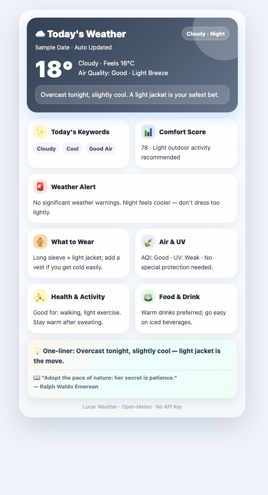

# 🌙 Lunar Weather

Generate polished daily weather cards for WeChat, Feishu/Lark, or any chat platform. No weather API key required — powered by Open-Meteo.



## Features

- **Live weather data** from Open-Meteo (free, no API key)
- **Dynamic card themes** — header changes color/style based on weather and day/night
- **Mobile-friendly PNG** — rendered via Microsoft Edge headless
- **Practical sections**: keywords, comfort score, alerts, outfit, air/UV, health, family tips, food, to-dos, quote
- **Multi-channel delivery**: WeChat, Feishu/Lark, or any chat app via OpenClaw

## Quick start

```bash
cd ~/.openclaw/workspace/skills/lunar-weather

# Fetch weather for any city
python3 scripts/get_weather_data.py "Shanghai" today

# Render card to PNG
python3 scripts/render_weather_card.py "Shanghai" today
```

Output goes to `outputs/`.

## Channel delivery examples

```bash
# WeChat / Weixin
openclaw message send \
  --channel openclaw-weixin \
  --target "<your-contact-id>" \
  --media outputs/weather-card-Shanghai-2026-05-08.png \
  --message "🌙 Today's weather card"

# Feishu / Lark
openclaw message send \
  --channel feishu \
  --account "<account-id>" \
  --target "user:<open-id>" \
  --media outputs/weather-card-Shanghai-2026-05-08.png \
  --message "🌙 Today's weather card"
```

## Weather → Theme mapping

| Weather | Day | Night |
|---|---|---|
| Clear 0–1 | sunny-day (blue/gold) | sunny-night (deep blue) |
| Cloudy 2–3 | cloudy-day (gray-blue) | cloudy-night (dark gray-blue) |
| Fog 45,48 | fog (muted gray-white) | fog |
| Rain 51–67,80–82 | rain-day (blue-gray) | rain-night (dark blue) |
| Snow 71–77,85–86 | snow (ice blue-white) | snow |
| Storm 95–99 | storm (purple-black + yellow) | storm |

## Files

- `scripts/get_weather_data.py` — fetch & normalize weather from Open-Meteo
- `scripts/render_weather_card.py` — HTML → PNG via Edge headless
- `assets/weather-card-template.html` — design reference template
- `assets/lunar-weather-preview.png` — preview image

## Requirements

- macOS (Edge headless used for PNG rendering)
- Microsoft Edge (installed)
- Python 3.10+
- OpenClaw with WeChat/Feishu channels configured

---

MIT License · Open-Meteo (no API key required)
